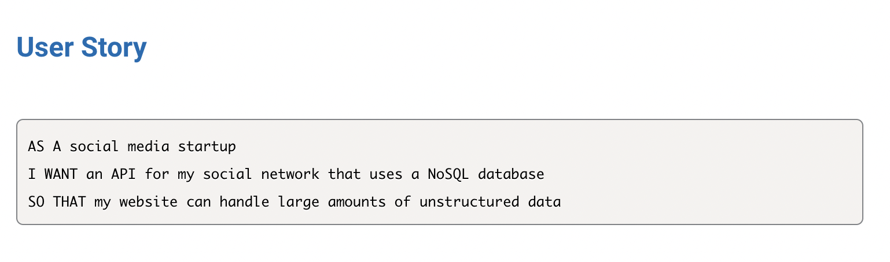

# Social-Network-API

## Description
This is a  social network web application where users can share their thoughts, react to friends’ thoughts, and create a friend list.

## User story 

## Usage 
* This application will allow users to:
    - Create a user
    - Add a friend
    - Create a thought
    - React to a thought
    - Delete a thought
    - Delete a friend
    - Delete a user
    - Delete a reaction

## Technologies Used

<a href="https://www.npmjs.com/package/express">Express</a>

<a href="https://www.npmjs.com/package/mongoose">Mongoose</a>

## Video Demo

<a href="https://drive.google.com/file/d/14Dz3336J19bDdqahHzhpdhTJg_fY1wrz/view"> Demonstration </a>
